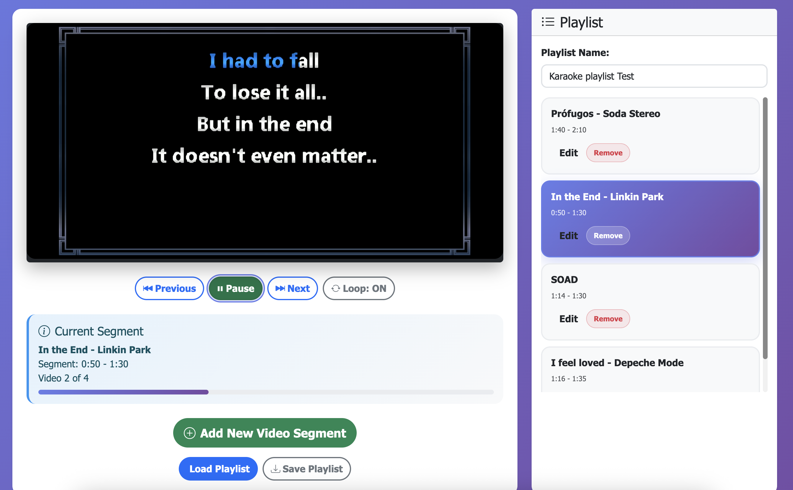

# 🎤 Karaokenator 1.0

**Professional Karaoke Playlist Manager with Advanced Transition Effects**

The Karaokenator is a specialized version of the YouTube Video Segments Playlist designed specifically for karaoke sessions. It features professional-grade transition effects, crowd cheers audio, and smooth volume fading to create an authentic karaoke experience.



## 🎬 Key Features

### 🎉 Professional Transition Effects
- **Transition Screen**: Beautiful countdown display between songs
- **Crowd Cheers Audio**: 21-second crowd applause between segments
- **Smart Countdown**: Emphasis on the last 5 seconds for dramatic effect
- **Seamless Looping**: Transitions work perfectly in loop mode

### 🔊 Advanced Audio Control
- **Volume Fade In**: Songs start at volume 0 and smoothly fade in over 2 seconds
- **Volume Fade Out**: Songs fade out smoothly 2 seconds before ending
- **Professional Audio**: Creates smooth, professional karaoke experience
- **Configurable Timing**: Adjustable fade durations

### 🎵 Karaoke-Focused Interface
- **Song Management**: Add/edit/remove karaoke songs with custom start/end times
- **Playlist Control**: Save/load karaoke playlists as JSON files
- **Loop Mode**: Continuous karaoke sessions
- **Progress Tracking**: Visual progress bar and current song info

## 🚀 Quick Start

### 1. Launch the Karaokenator
```bash
# Start the server
npm start

# Open in browser
http://localhost:3000/examples/karaokenator.html
```

### 2. Add Your First Karaoke Song
1. Click **"Add New Karaoke Song"**
2. Enter YouTube video URL or ID
3. Set start time (e.g., `0:30` for 30 seconds)
4. Set end time (e.g., `3:45` for 3 minutes 45 seconds)
5. Add song title (optional)

### 3. Start Your Karaoke Session
- Click **Play/Pause** to start
- Use **Previous/Next** to navigate songs
- Toggle **Loop** for continuous sessions
- Songs will automatically transition with crowd cheers!

## 🎛️ Configuration Options

The Karaokenator comes pre-configured with optimal settings, but you can customize:

```javascript
// Access the engine for advanced configuration
const engine = window.YouTubeSegmentsApp.getEngine();

// Customize transition effects
engine.setAudioEffectsEnabled(true);        // Enable crowd cheers
engine.setTransitionScreenEnabled(true);   // Show countdown screen
engine.setVolumeFadeEnabled(true);         // Enable volume fading

// Adjust timing
engine.setFadeInDuration(3);              // 3-second fade in
engine.setFadeOutDuration(3);              // 3-second fade out
engine.setAudioVolume(0.8);                // Crowd cheers volume (0-1)
```

## 🎤 Perfect for Karaoke Because...

### Professional Transitions
- **No Dead Air**: Crowd cheers fill the gap between songs
- **Visual Countdown**: Singers know exactly when the next song starts
- **Smooth Audio**: Volume fades prevent jarring audio cuts

### Easy Song Management
- **Custom Segments**: Play only the singing parts of songs
- **Quick Setup**: Add songs in seconds with YouTube URLs
- **Playlist Sharing**: Save and share karaoke playlists

### Continuous Sessions
- **Loop Mode**: Perfect for long karaoke parties
- **Auto-Advance**: Songs play automatically with transitions
- **Professional Feel**: Like having a real karaoke DJ

## 📁 File Structure

```
examples/
├── karaokenator.html          # Main Karaokenator interface
├── assets/
│   └── crowd-cheers.wav       # Crowd applause audio (21 seconds)
└── simple-ui-example.html     # Basic version without karaoke features
```

## 🎵 Sample Karaoke Playlist

Create playlists like this:

```json
{
  "name": "80s Karaoke Hits",
  "videos": [
    {
      "url": "https://www.youtube.com/watch?v=dQw4w9WgXcQ",
      "startTime": 0,
      "endTime": 212,
      "title": "Never Gonna Give You Up"
    },
    {
      "url": "https://www.youtube.com/watch?v=9bZkp7q19f0",
      "startTime": 0,
      "endTime": 180,
      "title": "Gangnam Style"
    }
  ]
}
```

## 🎛️ Controls

| Control | Function |
|---------|----------|
| **Add New Karaoke Song** | Add YouTube videos with custom segments |
| **Play/Pause** | Start/stop karaoke session |
| **Previous/Next** | Navigate between songs |
| **Loop Toggle** | Enable continuous karaoke mode |
| **Load Playlist** | Import saved karaoke playlists |
| **Save Playlist** | Export current playlist |

## 🔧 Technical Features

### Transition System
- **Duration**: 21-second transitions (matches crowd cheers audio)
- **Visual**: Dark overlay with song name and countdown
- **Audio**: Crowd applause plays during transition
- **Emphasis**: Last 5 seconds highlighted for dramatic effect

### Volume Management
- **Fade In**: 2-second smooth volume increase at song start
- **Fade Out**: 2-second smooth volume decrease before song end
- **Target Volume**: 100% (configurable)
- **Smooth Transitions**: No audio pops or clicks

### Audio Effects
- **Crowd Cheers**: Professional applause sound
- **Volume Control**: Adjustable audio effect volume
- **Synchronized**: Audio matches transition timing perfectly

## 🌐 Browser Compatibility

- ✅ **Chrome** (recommended)
- ✅ **Firefox**
- ✅ **Safari**
- ✅ **Edge**

## 🎤 Pro Tips

1. **Set Custom Segments**: Skip intros/outros, play only singing parts
2. **Use Loop Mode**: Perfect for karaoke parties
3. **Save Playlists**: Create themed karaoke collections
4. **Adjust Volume**: Lower crowd cheers volume if too loud
5. **Test First**: Preview songs before your karaoke event

## 🚨 Troubleshooting

### Crowd Cheers Not Playing
- Check browser audio permissions
- Ensure `examples/assets/crowd-cheers.wav` exists
- Try refreshing the page

### Transitions Not Working
- Verify `enableAudioEffects` and `enableTransitionScreen` are true
- Check browser console for errors
- Ensure YouTube API is loaded

### Volume Fade Issues
- Check `enableVolumeFade` setting
- Verify fade durations are reasonable (1-5 seconds)
- Test with different YouTube videos

## 📞 Support

For karaoke-specific issues or feature requests:
1. Check the main [README.md](README.md) for general troubleshooting
2. Open an issue on GitHub
3. Include browser version and error messages

---

**Ready to rock your karaoke party?** 🎤🎉

Start the Karaokenator and create unforgettable karaoke experiences with professional transitions and smooth audio!
