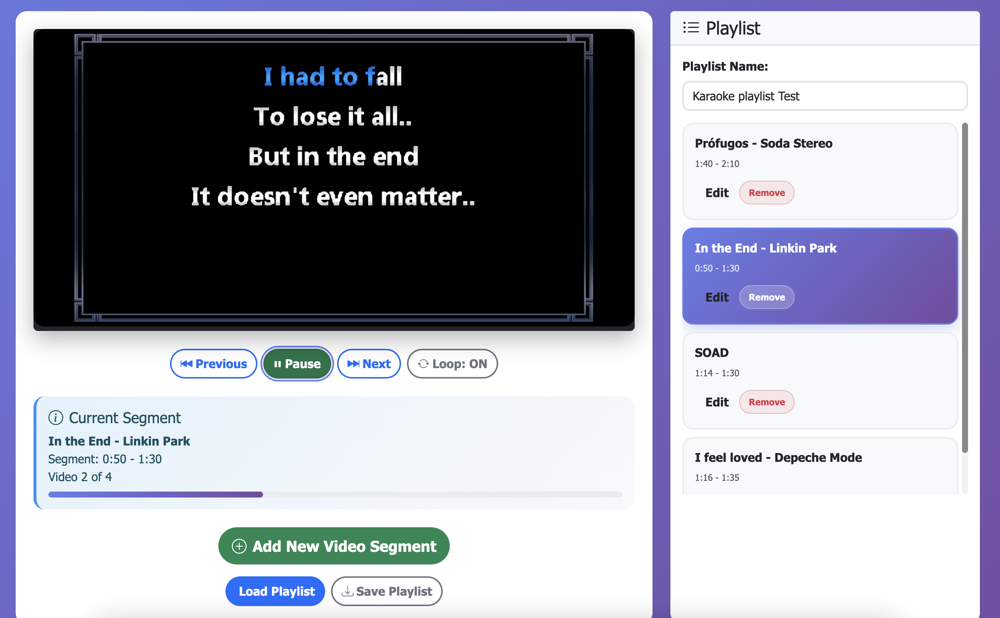

# YouTube Video Segments Playlist

A web application for creating custom playlists with specific start and end times for YouTube videos. Perfect for karaoke sessions, music practice, or any scenario where you need to play specific segments of videos.



## 🏗️ Architecture

This project now features a **modular architecture** that separates the core functionality from the UI, making it easy to create different user interfaces or integrate the engine into other applications.

### Core Components

- **YouTubeSegmentsEngine** (`js/engine/YouTubeSegmentsEngine.js`) - Core functionality API
- **UIAdapter** (`js/adapters/UIAdapter.js`) - Connects engine to existing UI components
- **PlayerManager** (`js/PlayerManager.js`) - YouTube IFrame API integration
- **PlaylistManager** (`js/PlaylistManager.js`) - Playlist data management
- **UIController** (`js/UIController.js`) - Original UI implementation

### Benefits of the New Architecture

- ✅ **Separation of Concerns**: Core logic is independent of UI
- ✅ **Reusability**: Engine can be used with different UIs
- ✅ **Testability**: Core functionality can be tested independently
- ✅ **Extensibility**: Easy to add new features or UIs
- ✅ **API-First**: Clean programmatic interface

## Features

- 🎵 Create playlists with custom start/end times for YouTube videos
- ▶️ Play segments automatically with seamless transitions
- 🎬 Transition screen with countdown between segments
- 🎉 Crowd cheers audio during transitions
- 🔊 Volume fade in/out effects for smooth audio
- 🔄 Loop playlists
- 💾 Save and load playlists as JSON files
- 🏗️ Modular architecture with clean API
- 🎨 Multiple UI examples included

## Prerequisites

- Node.js (version 20.0.0 or higher) - **Updated requirement**
- npm (comes with Node.js)
- nvm (Node Version Manager) - **Required for scripts**

## Installation

1. Clone the repository:
```bash
git clone https://github.com/jrenoldi/youtube-segments-playlist
cd youtube-segments-playlist
```

2. Install dependencies:
```bash
npm install
```

## Running the Application

### Option 1: Using Node.js Server (Recommended)
```bash
npm start
```
The application will be available at `http://localhost:3000`

**Note**: If you have nvm installed and want to ensure Node.js version 20 is used, you can run:
```bash
npm run start-with-nvm
```

### Option 2: Using Python Server
```bash
npm run serve
```
The application will be available at `http://localhost:8080`

## 🎬 New Features

### Transition Screen with Countdown
When a video segment ends, a transition screen appears showing:
- The name of the next song
- A countdown timer (21 seconds)
- Crowd cheers audio playing in the background
- Special emphasis on the last 5 seconds

### Volume Fade Effects
- **Fade In**: Videos start with volume 0 and smoothly fade in over 2 seconds
- **Fade Out**: Videos fade out smoothly 2 seconds before ending
- Creates a professional karaoke experience with smooth audio transitions

### Configuration Options
```javascript
const engine = new YouTubeSegmentsEngine({
    enableTransitionScreen: true,  // Show countdown between segments
    enableAudioEffects: true,     // Play crowd cheers audio
    enableVolumeFade: true,       // Smooth volume transitions
    fadeInDuration: 2,           // Fade in duration (seconds)
    fadeOutDuration: 2           // Fade out duration (seconds)
});
```

## 🚀 Using the Engine API

### Basic Usage

```javascript
import { YouTubeSegmentsEngine } from './js/engine/YouTubeSegmentsEngine.js';

// Initialize the engine
const engine = new YouTubeSegmentsEngine({
    playerId: 'player',
    autoAdvance: true,
    enableStorage: true
});

// Wait for engine to be ready
engine.on('engine:ready', () => {
    console.log('Engine ready!');
    
    // Add a video to the playlist
    engine.addVideo({
        url: 'https://www.youtube.com/watch?v=dQw4w9WgXcQ',
        startTime: 0,
        endTime: 30,
        title: 'Rick Roll (30s)'
    });
    
    // Start playing
    engine.play();
});
```

### Event System

The engine provides a comprehensive event system:

```javascript
// Player events
engine.on('player:ready', () => console.log('Player ready'));
engine.on('player:stateChanged', (data) => console.log('State:', data.state));
engine.on('player:error', (data) => console.error('Error:', data.error));

// Playlist events
engine.on('playlist:videoAdded', (data) => console.log('Added:', data.video.title));
engine.on('playlist:currentChanged', (data) => console.log('Current:', data.video.title));
engine.on('playlist:ended', () => console.log('Playlist finished'));

// Engine events
engine.on('engine:ready', () => console.log('Engine initialized'));
engine.on('engine:error', (data) => console.error('Engine error:', data.error));
```

### API Methods

```javascript
// Playlist management
engine.addVideo(videoData);
engine.updateVideo(index, videoData);
engine.removeVideo(index);
engine.clearPlaylist();

// Navigation
engine.next();
engine.previous();
engine.setCurrentVideo(index);

// Player controls
engine.play();
engine.pause();
engine.stop();
engine.togglePlayPause();

// Configuration
engine.toggleLoop();
engine.setVolume(50);
engine.seekTo(30);

// Data management
const playlist = engine.getPlaylist();
const status = engine.getStatus();
const exported = engine.exportPlaylist();
engine.importPlaylist(jsonString);
```

## 📁 Examples

### Simple UI Example

Check out `examples/simple-ui-example.html` for a minimal UI implementation that demonstrates how to use the engine API.

### Programmatic Example

See `examples/programmatic-example.js` for a comprehensive example of using the engine programmatically without any UI.

### Creating Your Own UI

```javascript
import { YouTubeSegmentsEngine } from './js/engine/YouTubeSegmentsEngine.js';

class MyCustomUI {
    constructor() {
        this.engine = new YouTubeSegmentsEngine({
            playerId: 'my-player',
            autoAdvance: true
        });
        
        this.setupEventListeners();
    }
    
    setupEventListeners() {
        this.engine.on('playlist:changed', (data) => {
            this.updatePlaylistDisplay(data.playlist);
        });
        
        this.engine.on('player:stateChanged', (data) => {
            this.updatePlayButton(data.isPlaying);
        });
    }
    
    updatePlaylistDisplay(playlist) {
        // Your custom UI update logic
    }
    
    updatePlayButton(isPlaying) {
        // Your custom button update logic
    }
}
```

## 🎮 How to Use the Original UI

1. **Add Video Segments**: Click "Add New Video Segment" and enter:
   - YouTube video URL or ID
   - Start time (in seconds or MM:SS format)
   - End time (in seconds or MM:SS format)
   - Optional title/description

2. **Play Controls**:
   - Use Previous/Next buttons to navigate between segments
   - Toggle loop mode for the entire playlist
   - Use Play/Pause to control playback

3. **Save/Load Playlists**:
   - Save your playlist as a JSON file
   - Load previously saved playlists

## 📁 File Structure

```
youtube-segments-playlist/
├── js/
│   ├── engine/
│   │   └── YouTubeSegmentsEngine.js    # Core engine API
│   ├── adapters/
│   │   └── UIAdapter.js                # UI adapter
│   ├── PlayerManager.js                # YouTube player management
│   ├── PlaylistManager.js              # Playlist data management
│   ├── UIController.js                 # Original UI controller
│   ├── VideoSegmentModal.js            # Video editing modal
│   ├── utils.js                        # Utility functions
│   └── app.js                          # Main application (simplified)
├── examples/
│   ├── simple-ui-example.html          # Minimal UI example
│   └── programmatic-example.js         # Programmatic usage example
├── styles/
│   └── main.css                        # Styles
├── index.html                          # Main HTML file
├── server.js                           # Development server
└── package.json                        # Dependencies and scripts
```

## 🔧 Development

### Adding New Features

1. **Core functionality**: Add to `YouTubeSegmentsEngine.js`
2. **UI features**: Add to `UIController.js` or create new UI components
3. **Adapter updates**: Update `UIAdapter.js` to connect new features

### Creating Custom UIs

1. Import the engine: `import { YouTubeSegmentsEngine } from './js/engine/YouTubeSegmentsEngine.js'`
2. Initialize with configuration: `new YouTubeSegmentsEngine(options)`
3. Listen to events: `engine.on('event:name', callback)`
4. Call methods: `engine.addVideo(data)`, `engine.play()`, etc.

## 📋 Sample Playlist

A sample playlist (`sample-playlist.json`) is included to help you get started.

## 🌐 Browser Compatibility

- Chrome (recommended)
- Firefox
- Safari
- Edge

## 📄 License

MIT License

## 🤝 Contributing

1. Fork the repository
2. Create a feature branch
3. Make your changes
4. Test with both the original UI and examples
5. Submit a pull request

## 📞 Support

If you encounter any issues or have questions about the new architecture, please open an issue on GitHub.
